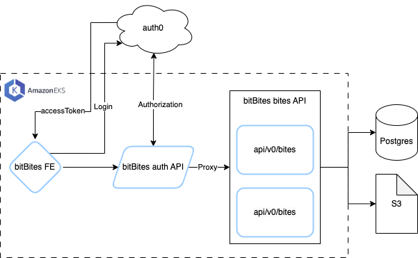

# bitBites infrastructure

Contains kubernetes deployment and service configurations for bitBites services.



## Prerequisites
Configured environment variables through these descriptors:
* secrets.yaml
* env-configmap.yaml

The application operates on top of environment variables:
* BITBITES_ACCESS_KEY_ID - AWS access key
* BITBITES_SECRET_ACCESS_KEY - AWS secret key
* BITBITES_SESSION_TOKEN - AWS session token
* POSTGRES_USER - RDS user name
* POSTGRES_PASSWORD - RDS password
* POSTGRES_DB - RDS db name
* POSTGRES_HOST - RDS host name
* JWKS_URL - Json Web Key url obtained from auth0
* NEXT_PUBLIC_BITES_API - The backend application url, this is only available after exposing the backend

The example files provide the environment variables. In secrets.yaml all values must be encoded into base64 hashes. For
this purpose there is a helper script under the `scripts` directory.

## Deployment

1. As a first step run the following scripts to create the necessary roles for EKS (the script by default uses the
`default` profile, provide it as an argument if you wish to change):
```shell
./scripts/setup_iam.sh
```

2. Create the EKS cluster
3. Add a node group
   * Minimum t3.large, 3 nodes

Continue with the rest of the steps.

Add metrics server (required for hpa)
```shell
kubectl apply -f secrets.yaml
kubectl apply -f env-configmap.yaml
kubectl apply -f https://github.com/kubernetes-sigs/metrics-server/releases/latest/download/components.yaml
```

**Helper scripts**

There are helper scripts in the directory to speed up things when running the application
```shell
./deployment/provision.sh
./service/provision.sh
```

## Local Development

To run containers locally, first you must create the network:
```shell
make run
```
The network can be created separately as well, using the underlying command.
